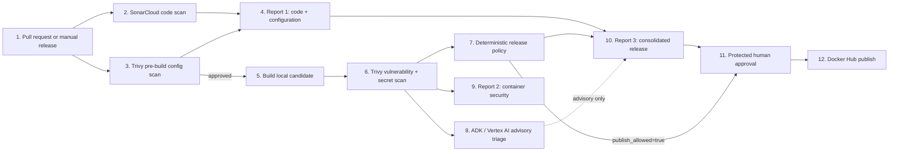

# Agentic DevSecOps Reference Pipeline

This repository demonstrates a policy-driven container release workflow that
combines deterministic security controls with an advisory Google ADK agent.
The flagship example scans source code and release configuration before a
Docker build, scans the built image, generates three audience-friendly reports,
and keeps publishing behind machine-enforced policy and human approval.

> **Portfolio/reference implementation:** this is useful as a working starting
> point, but it is not a drop-in production security platform. Review
> [Production readiness](docs/PRODUCTION-READINESS.md) before adapting it to a
> real organization.

## What it demonstrates

- SonarCloud source-code analysis and quality-gate evidence
- Trivy pre-build Dockerfile and deployment misconfiguration scanning
- Trivy post-build container vulnerability and secret scanning
- Fail-closed deterministic release authorization
- Advisory CVE triage with Google ADK and Vertex AI
- A standalone Claude Agent SDK implementation of the same advisory boundary
- A protected GitHub Environment approval before registry publication
- HTML/PDF reports for pre-build, image, and consolidated release results
- Immutable commit pinning for every third-party GitHub Action

## Architecture



The components are numbered `1`–`12`; arrows show their connections.

The model is deliberately outside the authorization path:

```text
Agent proposes → scanners and policy decide → protected gate approves → tool publishes
```

An ADK result cannot approve, reject, waive, downgrade, or override a release.
`policy_decision: not_evaluated` is not approval.

## Start in five minutes

Follow [the five-minute setup guide](docs/QUICKSTART.md). Google Cloud users
should then configure [keyless WIF authentication](docs/AUTHENTICATION.md).

## See both outcomes

- [Successful hardened-image example](ADK/container-hardening/examples/agentic-devops-portfolio/reports/scan-summary.md)
- [Intentionally blocked vulnerable-image example](ADK/container-hardening/examples/agentic-devops-portfolio/reports/vulnerable-release-gate-summary.md)
- [Commands and expected CI behavior](docs/DEMO-RUNS.md)

The vulnerable Dockerfile and Kubernetes manifest are training fixtures. Never
publish or deploy them.

## Repository map

| Path | Maturity | Purpose |
| --- | --- | --- |
| `ADK/container-hardening` | Flagship reference | Policy-driven Trivy and ADK container-security pipeline |
| `Claude/container-hardening` | Standalone comparison | Tool-disabled Claude Agent SDK advisory over sanitized Trivy evidence |
| `ADK/container-hardening/examples/agentic-devops-portfolio` | Runnable demo | Hardened and intentionally vulnerable release candidates |
| `ADK/terraform-plan-reviewer` | Portfolio prototype | Read-only Terraform plan review agent |
| `ADK/terraform-drift-detector` | Portfolio prototype | Read-only Terraform drift classifier |
| `ADK/devops-research-agent` | Scaffold/experiment | ADK research-agent example |

## Security and licensing

Read [SECURITY.md](SECURITY.md) before reporting a vulnerability or using the
pipeline for a real release. Original project code is available under the
[MIT License](LICENSE). Google ADK and scaffold-derived files retain their
upstream terms as described in [third-party notices](THIRD_PARTY_NOTICES.md).
